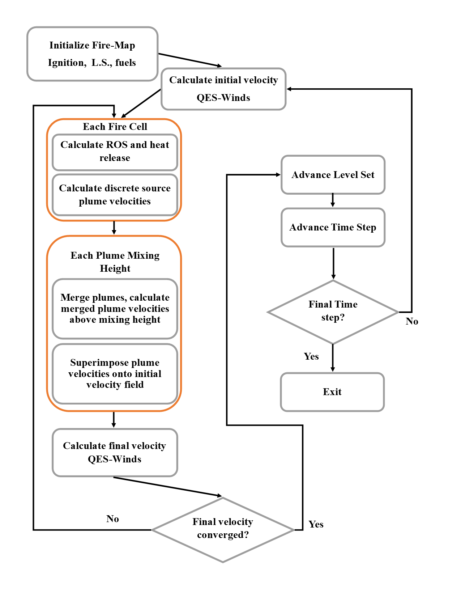

QES-Fire
========

Introduction
------------

QES-Fire :cite:`Moody2022,Moody2023` is a dynamically coupled wildfire
progression model based in the QES framework. QES-Fire uses the solver
from QES-Winds to couple atmospheric winds with fire-induced winds to
create a 3-D wind field. The wind field then drives a 1-D rate of spread
(ROS) model that advances the perimeter at all points along the fire
front using the level set method. A graphical representation of the fire
model is shown in figure below.

   Flowchart for QES-Fire

Fire-Induced Winds
~~~~~~~~~~~~~~~~~~

QES-Fire couples the atmospheric and fire-induced winds using a unique
multiscale approach. Wind parameterization is based on the Baum and
McCaffrey :cite:`Baum1989` buoyant plume rise model and the Kaye and
Lindon :cite:`kaye_linden_2004` turbulent axisymmetric plume merging
model. QES-Fire calculates nondimensional parameterized winds for
distinct plumes, and then scales the nondimensional winds by the heat
release to get a full 3-D wind field. Since the parameterization for
each plume is linear, distinct plumes can be vectorially added using
superpostion. QES-Winds treats each individual cell as a distinct plume
at the surface. As these buoyant plumes rise, QES-Fire uses the
methodology of Kaye and Lindon to merge the plumes together. The merging
height is calculated for nearby plumes, and the Baum and McCaffrey
parameterization is applied and superimposed with all other wind
vectors, from the surface to the merging height for each plume. From the
initial merging height, QES-Fire then calculates a new merge height for
plumes that have not yet merged. The process continues until all plumes
have merged, or the domain height is reached, whichever occurs first.

The fire-induced winds are then sumperimposed on the initial background
atmospheric winds calculated by QES-Winds. The QES-Winds solver is then
run again to solve the difference from the initial to the final velocity
using the variational method described in QES-Winds.

Rate of Spread
~~~~~~~~~~~~~~

QES-Fire uses two ROS models to drive the fire progression. The first is
the most widely used in the US, the Rothermel ROS model
:cite:`Rothermel1972`. The Rothermel model is an empirical model that
uses parameters for 13 fuel classes developed by Anderson
:cite:`anderson1982` and later expanded to 40 fuel classes by Scott and
Burgan :cite:`scott2005standard`. Other inputs for the Rothermel model
include wind at mid-flame height, slope of the terrain, and fuel
moisture.

The second ROS model is the simplified physics Balbi model
:cite:`Balbi2020`. The Balbi model uses simplifications for flame
geometry, radiative and convective heat transfer, and flame angle to
iteratively solve for ROS. Other inputs to the Balbi model include fuel
parameters, wind at the mid-flame height, terrain slope, and fuel
moisture. Since the Balbi model is an iterative model and requires an
initial guess for ROS, QES-Fire uses the Rothermel model to initialize
the Balbi model.

The output of the ROS model includes the 1-D ROS normal to the fire
front at a given point along the perimeter of the fire, the height of
the flame, the depth of the flame, and the time for the cell to burnout.
An additional output of the ROS model is the heat release per grid cell,
used by QES-Fire to scale the parameterized fire-induced winds.

Level Set
~~~~~~~~~

The fire front in QES-Fire is tracked and advanced using the level set
method :cite:`sethian1999`. At initialization all burning cells are set
as the zero level of the level set, :math:`\phi_{i,j}(t=0) = 0`, where
:math:`\phi` is the level set function, and the subscripts :math:`i` and
:math:`j` are the cell indices in the :math:`x` and :math:`y` directions
respectively. As the fire front cannot burn over ground where it has
already passed, an upwind numerical scheme to advance the level set is
appropriate, and is calculated as

.. math::

   \label{eq:levelSet}
       \phi_{i,j} = \phi_{i,j}^{0} - \Delta t\left[max(F_{i,j},0)\nabla^{+} + min(F_{i,j},0)\nabla^{-}\right],

where the superscript :math:`0` is the previous value for the level set
function, :math:`\Delta t` is the timestep, :math:`F_{i,j}` is the
forcing per cell, :math:`\nabla^{+}` is the forward in space gradient of
:math:`\phi`, and :math:`\nabla^{-}` is the backwards in space gradient
of :math:`\phi`. :math:`F_{i,j}` is the calculated ROS in a narrow band
surrounding the zero level set.

Parameter Files
---------------

The XML parameter file has the following structure, with the XML
elements corresponding to a different section of the model. See
QES-WINDS for simulation, domain, meteorological, building, vegetation,
and file options. Here, the XML structure for fire is presented.

.. code:: xml

   <QESWindsParameters>
       <simulationParameters>
           <!-- SEE QES-WINDS -->
       </simulationParameters>

       <metParams>
           <!-- SEE QES-WINDS -->
       </metParams>

       <buildingsParams>
           <!-- SEE QES-WINDS -->
       </buildingsParams>

       <vegetationParams>
           <!-- SEE QES-WINDS -->
       </vegetationParams>

       <turbParams>
           <!-- SEE QES-TURB -->
       </turbParams>

       <fires>
           <!-- FIRE PARAMETERS HERE-->
       </fires>

       <fileOptions>
           <!-- SEE QES-WINDS -->
       </fileOptions>
   </QESWindsParameters>

Fire XML
--------

Basic Parameters
~~~~~~~~~~~~~~~~

The time for the fire simulation to run is defined under <fireDur> in
seconds after the initial <timeStamp> in the <metParams> section (see
QES-Winds). QES-Fire uses a dynamic timestep with a modified Courant
number:cite:`Ferziger2002`, :math:`C` calculated as,

.. math::

   \label{eq:deltf}
       \Delta t_f = C \frac{max(\Delta x, \Delta y)}{max(\mathrm{ROS})},

where :math:`\Delta t_f` is the fire timestep, :math:`\Delta x` and
:math:`\Delta y` are the cell sizes in the :math:`x` and :math:`y`
directions, and :math:`max(\mathrm{ROS})` is the domain wide maximum
ROS. QES-Fire is numerically stable and the fire front cannot jump cells
when :math:`C\leq 1`.

.. code:: xml

   <fires>
       <!-- Fire simulation time -->
       <fireDur> 3600 </fireDur>
       <!-- Timestep Courant number -->
       <courant> 0.9 </courant>
       <!-- ... -->
   </fires>

Fuel Parameters
~~~~~~~~~~~~~~~

QES-Fire fuel elements for each grid cell are initialized through the
XML. These include the fuel class, the fuel moisture, and the moisture
content of live vegetation. The fuel type is a numeric value from
Anderson (1-13) or Scott and Burgan (98-215) and is specified throughout
the domain. Furthermore, QES-Fire has the ability to read a geoTiff for
heterogeneous fuel beds, with the address to the fuel file location
defined using <fuelMap>. If a fuel file is specified, QES-Fire will
ignore the fuel type specified. Dead fuel moisture is specified under
<fmc> as the fraction of water to fuel mass. Finally, for dynamic
conversion of live to dead fuel, the moisture content of live fuel is
specified under <cure> as the fraction of water to oven dry fuel mass.

.. code:: xml

   <fires>
       <!-- Fuel class -->
       <fuelType> 102 </fuelType>
       <!-- Address to fuel file -->
       <fuelMap>../FireFiles/test.tif</fuelMap>
       <!-- Dead fuel moisture content -->
       <fmc> 0.05 </fmc>
       <!-- Live fuel moisture content -->
       <cure> 0.3 </cure>
       <!-- ... -->
   </fires>

Ignitions
~~~~~~~~~

QES-Fire must have an initial ignition point specified in the XML.
Multiple ignitions may be specified, and all ignitions will occur at the
start of the simulation corresponding to the first <timeStep> in the
<metParams> section of the XML. For ignitions occurring after the
initial start, the user must provide a netCDF file with the structure of
’t’ = time after simulation start (seconds), ’x’ = x location in the
domain (meters), and ’y’ = y location in domain (meters).

.. code:: xml

   <fires>
       <!-- Ignition point in domain -->
       <ignition>
           <!-- Height of flame (meters) -->
           <height> 2 </height>
           <!-- Height of flame base above ground (meters) --> 
           <baseHeight> 0 </baseHeight>
           <!-- X location of ignition point in domain (meters) -->
           <xStart> 200.0 </xStart>
           <!-- Y location of ignition point in domain (meters) -->
           <yStart> 15.0 </yStart>
           <!-- X length of initial igntion (meters) -->
           <length> 6.0 </length>
           <!-- Y width of initial ignition (meters) -->
           <width>  6.0 </width>
       </ignition>
       <!-- Address to ignition file -->
       <igTimes>../FireFiles/FFII.nc</igTimes>
       <!-- ... -->
   </fires>

Example XML
~~~~~~~~~~~

The full XML used to run the FireFlux II simulation is included.

.. code:: xml

   <QESWindsParameters>
       <simulationParameters>
           <halo_x> 5.0 </halo_x>
           <halo_y> 5.0 </halo_y>
           <domain> 80 150 40 </domain>
           <cellSize> 5.0 5.0 .25 </cellSize>
           <verticalStretching> 0 </verticalStretching>
           <totalTimeIncrements> 1 </totalTimeIncrements>
           <maxIterations> 500 </maxIterations>
           <tolerance> 1e-9 </tolerance>
           <meshTypeFlag> 1 </meshTypeFlag>
       </simulationParameters>
       <metParams>
           <z0_domain_flag> 0 </z0_domain_flag>
           <sensor>
               <site_coord_flag> 1 </site_coord_flag>
               <site_xcoord> 1.0  </site_xcoord>
               <site_ycoord> 1.0 </site_ycoord>
               <timeSeries>
                   <timeStamp>2013-01-30T15:04:08</timeStamp>
                   <boundaryLayerFlag> 1 </boundaryLayerFlag>
                   <siteZ0> 0.1 </siteZ0>
                   <reciprocal> 0.0 </reciprocal>
                   <height>10.0 </height>
                   <speed> 8.9 </speed>
                   <direction> 295.0 </direction>
               </timeSeries>
           </sensor>
       </metParams>
       <fires>
           <fireDur> 1200 </fireDur>
           <fuelType> 103 </fuelType>
           <fmc> 0.065 </fmc>
           <cure> 0.3 </cure>
           <ignition>
               <height> 0.25 </height>
               <baseHeight> 0 </baseHeight>
               <xStart> 65.0 </xStart>
               <yStart> 655.0 </yStart>
               <length> 5.0 </length>
               <width> 5.0 </width>
           </ignition>
           <courant> 0.9 </courant>
           <igTimes>../FireFiles/FFII.nc</igTimes>
       </fires>
       <fileOptions>
           <outputFlag>1</outputFlag>
           <outputFields>all</outputFields>
       </fileOptions>
   </QESWindsParameters>
