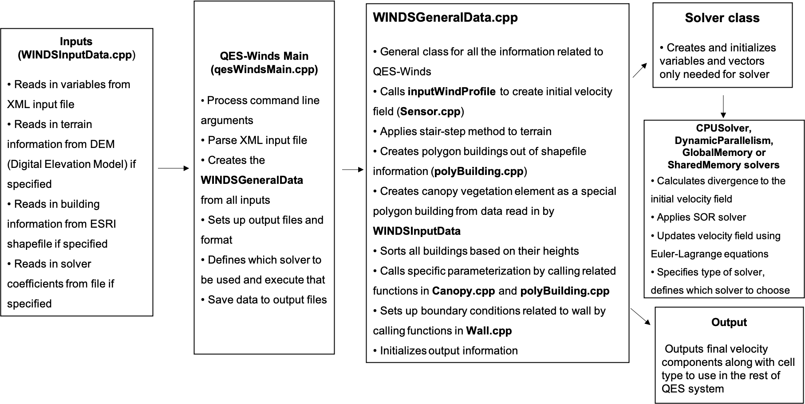
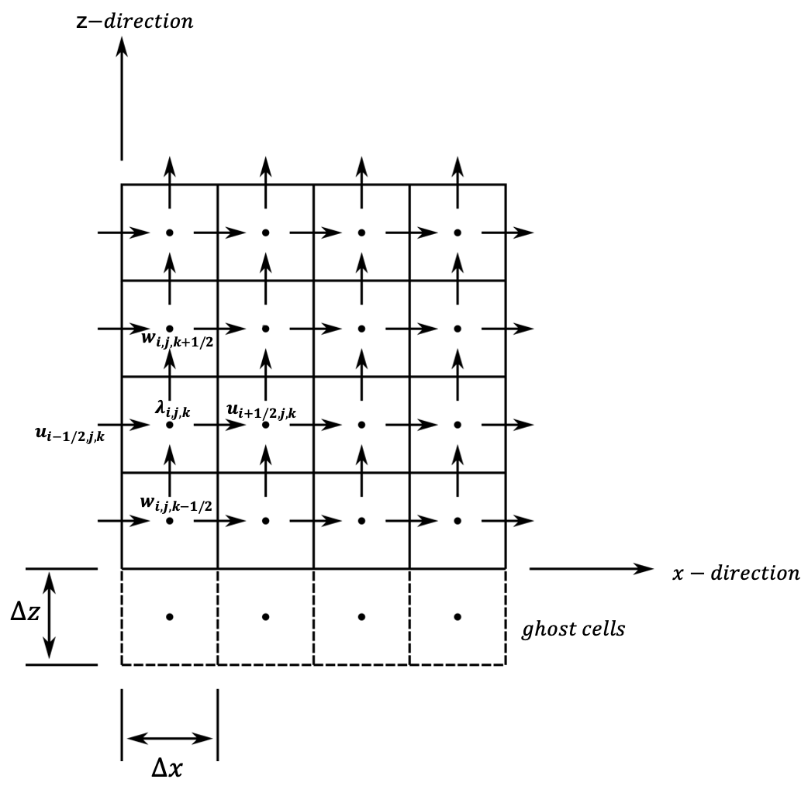
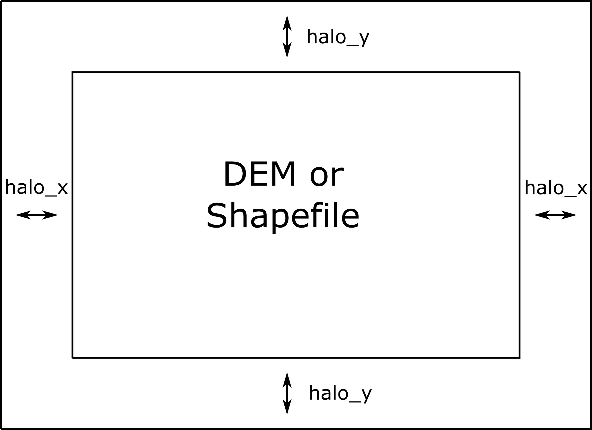
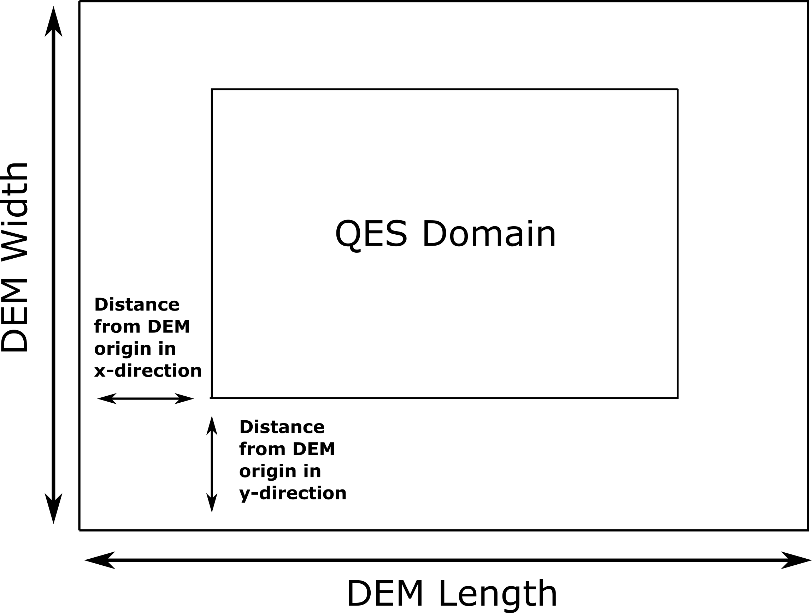
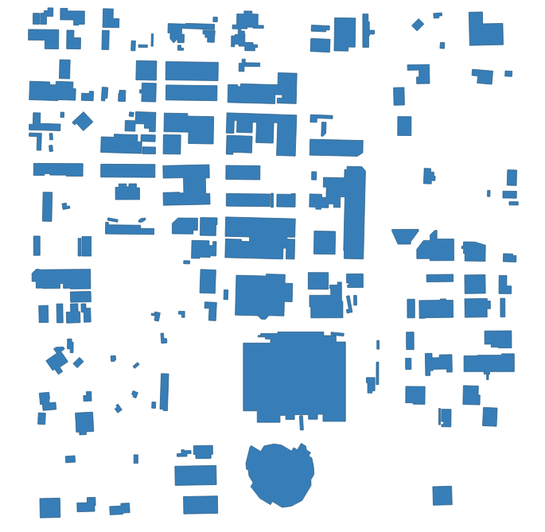
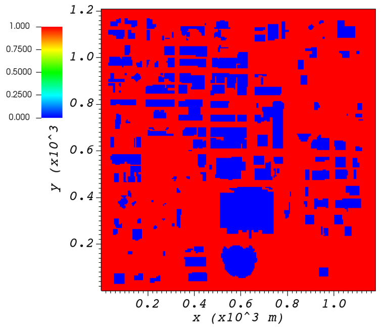
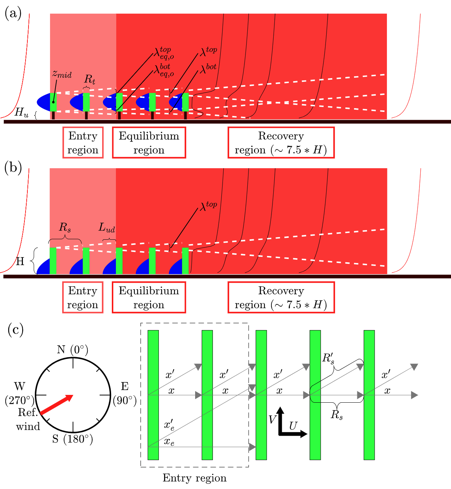

QES-Winds
=========

Introduction
------------

A new dispersion modeling system based on the well-used FORTRAN-based
QUIC (Quick Urban and Industrial Complex) dispersion modeling system
originally developed by the University of Utah and Los Alamos National
Laboratory :cite:`brown2013quic`, has been under development as
collaboration between the University of Utah and the University of
Minnesota, Duluth. Quick Environmental Simulation (QES) is a
microclimate simulation platform for computing 3D environmental scalars
in urban areas and over complex terrain.

The fast-response three-dimensional diagnostic wind model written in
C++, QES-Winds, is a rapid mass conserving wind-field solver. QES-Winds
utilizes the concept of dynamic parallelism in CUDA to substantially
accelerate wind simulations. Figure below shows a high-level flowchart
for QES-Winds code.

   Flowchart for the QES-Winds wind solver

Mass Consistent Solver
~~~~~~~~~~~~~~~~~~~~~~

Staggered Grid
^^^^^^^^^^^^^^

QES-Winds discretizes the computational domain using a staggered grid as
shown in figure below.

   Staggered grid representation of the domain and location of each
   variable.

The velocity components (:math:`u`, :math:`v` and :math:`w`) are
face-centered values and Lagrange multipliers (:math:`\lambda`),
divergence of the initial wind field (:math:`R`) and solver coefficients
(:math:`e`, :math:`f`, :math:`g`, :math:`h`, :math:`m` and :math:`n`)
are cell-centered variables. Because of nature of the finite difference
method (depending on neighboring cells values), the first and last cells
in :math:`x` and :math:`y` directions and the last cell in :math:`z`
direction, are not updated in the solving process (their velocity
remains as the same as the initial velocity field). For the same reason,
there is a layer of ghost cells under the bottom surface to make
velocity calculation in the first layer above the bottom surface
possible. The values of the Lagrange multipliers for the ghost cells are
set to the ones for the layer above the bottom surface to create a zero
gradient for the Lagrange multipliers (boundary condition) as well as
providing the neighboring cell for the finite difference method.

Poisson Equation
^^^^^^^^^^^^^^^^

QES-Winds have mass conserving wind field solvers that rapidly compute
wind fields using a variational method rather than slower yet more
physics based solvers that include conservation of momentum
:cite:`kim2014effects`. While the QES-Winds method uses reduced order
physics in the numerical solution of urban flow problems, the solutions
are rapid and compare quite well higher order physics-based models in
both idealized :cite:`hayati2017comprehensive` and realistic urban
cities :cite:`neophytou2011inter`. The method minimizes the difference
between an initial wind field that is specified using empirical
parameterizations :cite:`singh2008evaluation` and the final wind fields.
The empirical parameterizations account for complex wind fields around
buildings such as wake cavities downstream of a building. To obtain a
quasi-time-averaged velocity field, QES-Winds uses a variational
analysis technique :cite:`singh2008evaluation`. This method requires the
solution of a Poisson equation for Lagrange multipliers, :math:`\lambda`
in the following form:

.. math::

   \label{poisson}
   \frac{\partial^2\lambda}{\partial x^2} + \frac{\partial^2\lambda}{\partial y^2} + (\frac{\alpha_1}{\alpha_2})^2\:  \frac{\partial^2\lambda}{\partial z^2} = R

Where R is divergence of the initial wind field and is defined as:

.. math::

   \label{divergence}
    R = -2\,\alpha_1^2\,\Bigg[\frac{u_{i+1/2}^0-u_{i-1/2}^0}{\Delta x} + \frac{v_{j+1/2}^0-v_{j-1/2}^0}{\Delta y} + \frac{w_{k+1/2}^0-w_{k-1/2}^0}{\Delta z}\Bigg]

The final velocity field is updated using Euler-Lagrange equations:

.. math::

   \label{eu-lag1}
    u = u^0 + \frac{1}{2\,\alpha_1^2\,\Delta x}\,[\lambda_{i+1\,,j,\,k}-\lambda_{i,\,j,\,k}]

.. math::

   \label{eu-lag2}
    v = v^0 + \frac{1}{2\,\alpha_1^2\,\Delta y}\,[\lambda_{i,\,j+1,\,k}-\lambda_{i,\,j,\,k}]

.. math::

   \label{eu-lag3}
    w = w^0 + \frac{1}{2\,\alpha_2^2\,\Delta z}\,[\lambda_{i,\,j,\,k+1}-\lambda_{i,\,j,\,k}]

The Poisson equation is solved using the Successive Over-Relaxation
(SOR) method which is a variant of Gauss-Seidel method with faster
convergence. Applying the SOR scheme to the Poisson equation for
Lagrange multipliers results in:

.. math::

   \label{SOR}
   \begin{split}
    \lambda_{i,\,j,\,k} & = \frac{\omega\Bigg[(\Delta x)^2 R_{i,\,j,\,k}+e\,\lambda_{i+1}+f\, \lambda_{i-1}+A(g\,\lambda_{j+1}+h\, \lambda_{j-1}) + B(m\,\lambda_{k+1}+n\, \lambda_{k-1})\Bigg]}{e+f+g+h+m+n}\\
    & +(1-\omega)\lambda_{i,\,j,\,k}
    \end{split}

Where e,f,g,h,m,n are boundary condition coefficients and A and B are
domain constants. :math:`\omega = 1.78` is the SOR relaxation factor.
The boundary condition for solid surfaces is
(:math:`\frac{\partial \lambda}{\partial n}=0`) and for inlet/outlet
surfaces it is :math:`\lambda=0`.

Solver Types
^^^^^^^^^^^^

QES-Winds has four options for solving the SOR equation discussed above,
the first option is to solve the equation on the CPU and the rest use
the GPU for computations. The GPU solvers are called: the dynamic
parallel, the global memory and the shared memory. The CPU solver is
quite rapid, but slow in comparison to the GPU solvers since it is a
serial solver and does not have parallel computing capabilities,
especially for large domains. For more information regarding different
types of solvers available in QES-Winds, read :cite:`Bozorgmehr2021`.

Parameter Files
---------------

The XML parameter file has the following structure, with the XML
elements corresponding different section of the model. Each of them are
presented in the sections below (expect <turbParams> which is presented
in QES-Turb).

.. code:: xml

   <QESWindsParameters>
       <simulationParameters>
           <!-- HERE COMES THE SIMULATION PARAMETERS -->
       </simulationParameters>

       <metParams>
           <!-- HERE COMES THE MET PARAMETERS -->
       </metParams>

       <buildingsParams>
           <!-- HERE COMES THE BUILDING PARAMETERS -->
       </buildingsParams>

       <vegetationParams>
           <!-- HERE COMES THE VEGETATION PARAMETERS -->
       </vegetationParams>

       <turbParams>
           <!-- HERE COMES THE TURBULENCE PARAMETERS -->
       </turbParams>

       <fileOptions>
           <!-- HERE COMES THE FILE PARAMETERS -->
       </fileOptions>
   </QESWindsParameters>

QES-Winds Domain (simulationParameters)
---------------------------------------

The first step in every computational code or package is to define the
computational domain. The user can define the domain by specifying the
number of cells in :math:`x`, :math:`y` and :math:`z` directions as well
as the cell size in each direction in the input file (XML file).

Basic Parameters
~~~~~~~~~~~~~~~~

The domain information (number of cells and cell size) are defined under
the <simulationParameters> part of the XML file. Following is an example
of a domain with :math:`2` km by :math:`2` km by :math:`200` m and
resolution of :math:`2` m by :math:`2` m by :math:`2` m:

.. code:: xml

   <simulationParameters>
       <!-- Number of cells in x,y and z directions-->
       <domain> 1000 1000 100 </domain>
       <!-- Mesh resolution (meters)-->
       <cellSize> 2.0 2.0 2.0 </cellSize>
       <!-- vertical stretching (0-uniform grid (default), 1-costum grid)-->
       <verticalStretching> 0 </verticalStretching>   
       <!-- Number of time steps-->           
       <totalTimeIncrements> 1 </totalTimeIncrements>          
       
       <!-- ... -->
   </simulationParameters>

Note, <verticalStretching> is currently under development. The last
parameter lets the user define the number of time instances that need to
run, assuming the correct number of sensor time steps are define in
<metParams>. This parameter can be set to 0 to let the program decide
how many time instances need to be run based on input parameters.

Halo Region
~~~~~~~~~~~

If a solid element (building or terrain) overlaps with the QES domain
boundaries, QES-Winds cannot model the wind field around the element
correctly. In order to prevent this phenomenon, the user can add buffer
zones to the sides of the domain when a terrain file or an ESRI
shapefile is read into the code. Figure below represents how the halo
region is added to the domain around a Digital Elevation Model (DEM) or
a shapefile.

   Representation of halo region around the domain.

In order to define length of the halo zone in :math:`x` and :math:`y`
direction, the user can use <halox> and <haloy> under
<simulationParameters>. When the halo zone is defined, the length of the
domain (:math:`nx*dx`) and (:math:`ny*dy`), should be greater than or
equal to length of the DEM or shapefile in each direction plus twice the
length of the halo in :math:`x` and :math:`y` directions, respectively.

.. code:: xml

   <simulationParameters>
       <!-- Halo region added to x-direction of domain (at the beginning and the end of domain) (meters)-->
       <halo_x> 20.0 </halo_x>
       <!-- Halo region added to y-direction of domain (at the beginning and the end of domain) (meters)-->
       <halo_y> 30.0 </halo_y>
       
       <!-- ... -->
   </simulationParameters>

Digital Elevation Model (DEM)
~~~~~~~~~~~~~~~~~~~~~~~~~~~~~

The current version of QES-Winds has been written to allow commonly
available terrain and building geometry datasets to be used for
simulations. In this section, various input file formats for QES-Winds
will be covered.

Terrain Features
^^^^^^^^^^^^^^^^

Using the Geospatial Data Abstraction Library (GDAL;
https://www.gdal.org), we are able to load geo-referenced datasets of
terrain so that the simulations can include the effects of hills,
valleys, and mountains. In the current version of the code, we can load
Digital Elevation Model (DEM) files for different physical locations.

Using the Digital Elevation Model (DEM) file loaders in our code base,
we have loaded and tested multiple different terrain data sets. As a
first test, we loaded a DEM of Askervein Hill. This is an isolated hill
in Scotland where field experiments have been conducted and data for
testing and evaluation exists
(:cite:`taylor1987askervein,mickle1988askervein`). The simulation with
Askervein Hill was run without any complex terrain flow
parameterizations. The Askervein Hill dataset is :math:`6023.43` m by
:math:`6023.43` m. The hill height is approximately :math:`124` m tall.
Figure below indicates the cell type contour for the Askervin hill test
case in a vertical plane at :math:`y = 3000` m (part (a)), and a
horizontal plane at :math:`z=20` m (part (b)). These plots show the
ability of QES-Winds to read in and process DEM files. The cell type
value :math:`1` (blue) represents the air cells while value :math:`2`
(red) indicates the terrain cells.

.. figure:: Images/askervein.pdf

   Cell type contour for the Askervin hill test case in a (a) vertical
   plane at :math:`y=3000` m, (b) horizontal plane at :math:`z=20` m.
   The cell type value :math:`1` (blue) represents the air cells while
   value :math:`2` (red) indicates the terrain cells.

The user can define the address to the DEM using <DEM> variable under
the <simulationParameters> part in the XML file:

.. code:: xml

   <simulationParameters>
       <!-- Address to DEM location-->
       <DEM>../scratch/DEM/askervein.tif</DEM>
       
       <!-- ... -->
   </simulationParameters>

Process Part of DEM
^^^^^^^^^^^^^^^^^^^

In some cases, user wants to load a giant DEM but only process part of
the file. This is possible in QES-Winds by defining the origin of QES
domain inside the DEM borders and the size of the QES domain. Figure
below shows a schematic of how the QES domain can be defined inside a
DEM file and only process that part.

   Schematic of how the QES domain can be defined inside a DEM file and
   only process that part.

There are two options to determine the location of the origin of QES
domain inside the DEM borders:

#. Specifying the distance of the QES origin with respect to bottom left
   corner of the DEM file. This can be done by setting the value of
   <originFlag> to :math:`0` and defining distances (in meters) in
   :math:`x` and :math:`y` directions using <DEMDistancex> and
   <DEMDistancey>, respectively.

   .. code:: xml

      <simulationParameters>
          <!-- Origin flag (0- DEM coordinates (default), 1- UTM coordinates) -->
          <originFlag> 0 </originFlag>
          <!-- x component (m) of origin in DEM coordinates (if originFlag = 0) -->
          <DEMDistancex> 1000.0 </DEMDistancex>
          <!-- y component (m) of origin in DEM coordinates (if originFlag = 0) -->
          <DEMDistancey> 1000.0 </DEMDistancey>
          
          <!-- ... -->
      </simulationParameters>

#. Defining the location of the QES domain origin in the Universal
   Transverse Mercator (UTM) coordinates by setting the value of
   <originFlag> to :math:`1` and determining <UTMx> and <UTMy> of the
   origin in :math:`x` and :math:`y` directions, respectively.

   .. code:: xml

      <simulationParameters>
          <!-- Origin flag (0- DEM coordinates (default), 1- UTM coordinates) -->
          <originFlag> 1 </originFlag>
          <!-- x component (m) of origin in UTM DEM coordinates (if originFlag = 1)-->
          <UTMx> 595469.6122881 </UTMx>
          <!-- y component (m) of origin in UTM DEM coordinates (if originFlag = 1)-->
          <UTMy> 6336281.9538635 </UTMy>
          
          <!-- ... -->
      </simulationParameters>

Initial Wind Field (metParams)
------------------------------

QES-Winds can read a single or multiple sensors for a specific test
case. In this context, sensor means the velocity magnitude and direction
at a single point or a single velocity profile to initialize the wind
field. If there is only the wind velocity and direction at a single
point, the user should specify what type of velocity profile they want
to build from the measurement. There are three options available for the
type of profile:

#. a logarithmic profile :cite:`favaloro2008toward`:

   .. math::

      \label{eq:log_law}
      u_{log}(z) = u_{ref}\cdot\frac{\ln(z/z_0)}{\ln(z_{ref}/z_0)}

   where :math:`u_{ref}` is the measured velocity at measured height
   :math:`z_{ref}`, :math:`z_0` is the surface roughness.

#. a power law profile :cite:`favaloro2008toward`:

   .. math::

      \label{eq:power_law}
      u_{pow}(z) = u_{ref}\cdot(z/z_{ref})^{p}

   where :math:`u_{ref}` is the measured velocity at measured height
   :math:`z_{ref}`, :math:`p` is the power law exponent.

#. an urban canopy profile :cite:`favaloro2008toward,pardyjak2008near`:

   .. math::

      \label{eq:urban_canopy_low}
      u_{uc}(z)=\begin{cases}
      u_H\cdot\exp(\alpha(\frac{z}{H}-1)) & \text{if } z\leq H\\
      \frac{u_*}{\kappa}\cdot \ln(\frac{z-d}{z_0}) & \text{if } z > H.
      \end{cases}

   Here the profile is separated into two parts: below and above the
   canopy height :math:`H`. The method uses the reference velocity
   :math:`u_{ref}` is the measured velocity at measured height
   :math:`z_{ref}` and the attenuation coefficient :math:`\alpha` to
   calculate, via bisection, the zero plane displacement height
   :math:`d`, the velocity at the canopy top :math:`u_H`, and the
   friction velocity :math:`u_*`. The lower portion of the urban canopy
   profile is calculated as an exponential reaching the velocity at the
   canopy top :math:`u_H`, and the upper portion of the urban canopy is
   a logarithmic profile using the computed :math:`u_*` and :math:`d`,
   with :math:`\kappa \sim 0.4` the von Karman constant.

Figure below shows velocity profiles of used for the initial velocity
field using each of the scheme presented above.

.. figure:: Images/VelocityProfiles.pdf

   Velocity profiles created using (1) logarithmic profile, (2) power
   law profile, and (3) urban canopy profile.

If there is only one sensor available in the computational domain, the
code will extend the profile for that sensor uniformly to the whole
domain. On the occasion of multiple sensors, QES-Winds utilizes a
two-dimensional Barnes interpolation scheme
:cite:`koch1983interactive,booth2012validation` to interpolate velocity
components at each cell height of the domain based on the weighted
distance from each sensor.

.. _`sec:sensor_xml`:

XML Setup
~~~~~~~~~

There are two options available for defining sensor information:

#. The user can define all information required for creating a sensor by
   using the <sensor> variable inside the <metParams> section of the XML
   file. An example of this section is presented below:

   .. code:: xml

      <!-- Meteorological parameters -->
      <metParams>
          <!-- Distribution of surface roughness for domain (0-uniform (default), 1-custom -->
          <z0_domain_flag> 0 </z0_domain_flag>                    
          
          <!-- Define a sensor -->  
          <sensor>
              <!-- Sensor site coordinate system (1=QES (default), 2=UTM, 3=Lat/Lon) -->      
              <site_coord_flag> 1 </site_coord_flag>          
              <site_xcoord> 100.0  </site_xcoord>         
              <site_ycoord> 140.0 </site_ycoord> 
              
              <!-- Start of timestep information for a sensor -->
              <timeSeries>            
                  <timeStamp>2003-07-23T23:00:00</timeStamp>                  
                  <boundaryLayerFlag> 1 </boundaryLayerFlag>  
                  <siteZ0> 0.1 </siteZ0>          
                  <reciprocal> 0.0 </reciprocal>  
                  <height> 10.0 </height>         
                  <speed> 5.0 </speed>            
                  <direction> 270.0 </direction>  
              </timeSeries>
          </sensor>
      </metParams>    

   In that case, multiple sensors can be defined in this section, each
   added using <sensor>...</sensor>.

#. The user can put all the sensor information in a separate XML file
   and define the address to the location of the sensor file using the
   <sensorName> variable.

   .. code:: xml

      <metParams>
          <!-- Distribution of surface roughness for domain (0-uniform (default), 1-custom -->
          <z0_domain_flag> 0 </z0_domain_flag>
          <!-- Name of the sensor file with information for the sensor included -->
          <sensorName>../data/InputFiles/sensor.xml</sensorName>
      </metParams>

   An example of the sensor file is presented below:

   .. code:: xml

      <sensor>
          <!-- Sensor site coordinate system (1=QES (default), 2=UTM, 3=Lat/Lon) --> 
          <site_coord_flag> 1 </site_coord_flag>      
          <site_xcoord> 590.0  </site_xcoord>         
          <site_ycoord> 1.0 </site_ycoord>            

          <!-- Start of timestep information for a sensor -->
          <timeSeries>
              <timeStamp>2003-07-23T23:00:00</timeStamp>      
              <boundaryLayerFlag> 3 </boundaryLayerFlag>  
              <siteZ0> 0.3 </siteZ0> 
              <reciprocal> 0.0 </reciprocal>
              <height> 17.23 </height>                
              <speed> 5.15 </speed>                   
              <direction> 153.83 </direction>             
              <canopyHeight> 10.1 </canopyHeight>
              <attenuationCoefficient> 2.41 </attenuationCoefficient>
          </timeSeries>

          <!-- ... -->
      </sensor>

   In that case, multiple sensors can be defined each in their separate
   XML file.

The first part of the sensor information is the location of the sensor
in domain. There are three options for it:

#. define the location in local coordinates of the QES domain.

   .. code:: xml

      <sensor>
          <!-- Sensor site coordinate system (1=QES (default), 2=UTM, 3=Lat/Lon) -->
          <site_coord_flag> 1 </site_coord_flag>
          <!-- x component of site location in QES domain (m) (if site_coord_flag = 1) -->
          <site_xcoord> 1.0  </site_xcoord>
          <!-- y component of site location in QES domain (m) (if site_coord_flag = 1)-->
          <site_ycoord> 1.0 </site_ycoord>
          
          <!-- ... -->
      </sensor>

#. The user can define the location in the UTM coordinates.

   .. code:: xml

      <sensor>
          <!-- Sensor site coordinate system (1=QES (default), 2=UTM, 3=Lat/Lon) -->
          <site_coord_flag> 2 </site_coord_flag>
          <!-- x components of site coordinate in UTM -->
          <site_UTM_x> 634175 </site_UTM_x>
          <!-- y components of site coordinate in UTM-->
          <site_UTM_y> 3925362 </site_UTM_y>
          <!-- UTM zone of the sensor site -->
          <site_UTM_zone> 14 </site_UTM_zone>
          
          <!-- ... -->
      </sensor>

   In this case, user also needs to define the origin of computational
   domain in the UTM coordinates.

   .. code:: xml

      <simulationParameters>
          <!-- x component (m) of origin in UTM -->
          <UTMx> 634173 </UTMx>
          <!-- y component (m) of origin in UTM -->
          <UTMy> 3925360 </UTMy>
          <!-- UTM zone that domain located -->
          <UTMZone> 14 </UTMZone>
      </simulationParameters>

#. The user can define the location in Latitude and Longitude
   coordinates.

   .. code:: xml

      <sensor>
          <!-- Sensor site coordinate system (1=QES (default), 2=UTM, 3=Lat/Lon) -->
          <site_coord_flag> 3 </site_coord_flag>
          <!-- x components of site coordinate in Latitude -->
          <site_lat> 35.46270 </site_lat>
          <!-- y components of site coordinate in Longitude -->
          <site_lat> -97.52130 </site_lat>
          
          <!-- ... -->
      </sensor>

   In this case, user also needs to define the origin of computational
   domain in the UTM coordinates.

   .. code:: xml

      <simulationParameters>
          <!-- x component (m) of origin in UTM -->
          <UTMx> 634173 </UTMx>
          <!-- y component (m) of origin in UTM -->
          <UTMy> 3925360 </UTMy>
          <!-- UTM zone that domain located -->
          <UTMZone> 14 </UTMZone>
      </simulationParameters>

The second part of sensor definition is choosing type of profile for
different time steps, if applicable. The <timeSeries> variable is
designed to define type of sensor profile in the sensor section for
several time steps. There are four options for the input profile in
QES-Winds:

#. Logarithmic velocity profile:

   .. code:: xml

      <!-- Start of timestep informastion for a sensor -->
      <timeSeries>
          <!-- time of the current data input -->
          <timeStamp>2003-07-23T23:00:00</timeStamp>      
          <!-- Site BL flag (1-log (default), 2-exp, 3-urban canopy, 4-data entry) -->
          <boundaryLayerFlag> 1 </boundaryLayerFlag>
          <!-- Site surface roughness -->
          <siteZ0> 0.1 </siteZ0>
          <!-- Reciprocal Monin-Obukhov Length (1/m) -->
          <reciprocal> 0.0 </reciprocal>
          <!-- Height of the sensor -->
          <height> 20.0 </height>
          <!-- Measured speed at the sensor height -->
          <speed> 5.0 </speed>
          <!-- Wind direction of sensor -->
          <direction> 270.0 </direction>
      </timeSeries>

#. Exponential (power law) velocity profile:

   .. code:: xml

      <!-- Start of timestep informastion for a sensor -->
      <timeSeries>
          <!-- time of the current data input -->
          <timeStamp>2003-07-23T23:00:00</timeStamp>  
          <!-- Site BL flag (1-log (default), 2-exp, 3-urban canopy, 4-data entry) -->
          <boundaryLayerFlag> 2 </boundaryLayerFlag>
          <!-- Site exponent (using z0 variable) -->
          <siteZ0> 0.1 </siteZ0>
          <!-- Reciprocal Monin-Obukhov Length (1/m) -->
          <reciprocal> 0.0 </reciprocal>
          <!-- Height of the sensor -->
          <height> 20.0 </height>
          <!-- Measured speed at the sensor height -->
          <speed> 5.0 </speed>
          <!-- Wind direction of sensor -->
          <direction> 270.0 </direction>
      </timeSeries>

#. Urban canopy velocity profile:

   .. code:: xml

      <!-- Start of timestep informastion for a sensor -->
      <timeSeries>
          <!-- time of the current data input -->
          <timeStamp>2003-07-23T23:00:00</timeStamp>  
          <!-- Site BL flag (1-log (default), 2-exp, 3-urban canopy, 4-data entry) -->
          <boundaryLayerFlag> 3 </boundaryLayerFlag>
          <!-- Site z0 -->
          <siteZ0> 0.1 </siteZ0>
          <!-- Reciprocal Monin-Obukhov Length (1/m) -->
          <reciprocal> 0.0 </reciprocal>
          <!-- Height of the sensor -->
          <height> 20.0 </height>
          <!-- Measured speed at the sensor height -->
          <speed> 5.0 </speed>
          <!-- Wind direction of sensor -->
          <direction> 270.0 </direction>
          <!-- Height of the canopy -->
          <canopyHeight> 10.0 </canopyHeight>
          <!-- attenuation coefficient -->
          <attenuationCoefficient> 1.0 </attenuationCoefficient>
      </timeSeries>

#. Data entry of the profile from an experimental tower with multiple
   sensors or from a numerical mesoscale weather prediction model like
   WRF :cite:`powers2017weather`:

   .. code:: xml

      <!-- Start of timestep information for a sensor -->
      <timeSeries>
          <!-- time of the current data input -->
          <timeStamp>2003-07-23T23:00:00</timeStamp>  
          <!-- Site BL flag (1-log, 2-exp, 3-urban canopy, 4-data entry) -->
          <boundaryLayerFlag> 4 </boundaryLayerFlag>
          <!-- Site z0 -->
          <siteZ0> 0.1 </siteZ0>
          <!-- Reciprocal Monin-Obukhov Length (1/m) -->
          <reciprocal> 0.0 </reciprocal>
          <!-- Height of the sensor -->
          <height> 30.7015 </height>
          <height> 74.4169 </height>
          <height> 144.644 </height>
          <height> 197.455 </height>
          <height> 268.468 </height>
          <!-- Measured speed at the sensor height -->
          <speed> 2.56922 </speed>
          <speed> 2.55532 </speed>
          <speed> 2.33319 </speed>
          <speed> 2.16058 </speed>
          <speed> 1.98843 </speed>
          <!-- Wind direction of sensor -->
          <direction> 323.283 </direction>
          <direction> 327.377 </direction>
          <direction> 332.676 </direction>
          <direction> 337.649 </direction>
          <direction> 344.273 </direction>
      </timeSeries>

Building Parameters (buildingsParams)
-------------------------------------

QES-Winds only conserves mass and no momentum equation is solved. As a
result, the solution is a potential-flow solution (no shear effects). In
order to add shear effects to our solution, empirical parameterizations
are needed. These parameterizations are designed using results of
experiments and computational simulations (e.g.
:cite:`singh2008evaluation,brown2013quic`). Buildings are the most
important elements in urban areas. There are several parameterizations
developed for different areas around the building. This section covers
available parameterizations in QES-Winds along with their effects on the
wind field.

.. code:: xml

   <buildingsParams>
       <!-- Address to shapefile location-->
       <SHPFile>SaltLakeCity/slc_cut.shp</SHPFile>
       <!-- Name of building layer in shapefile-->
       <SHPBuildingLayer>slc_cut</SHPBuildingLayer>
       <!-- Name of building height field in shapefile -->
       <SHPHeightField>MEANHEIGHT</SHPHeightField>
       <!-- Height factor multiplied by the building height in the shapefile (default = 1.0)-->
       <heightFactor> 1.0 </heightFactor>

       <wallRoughness>0.01</wallRoughness>

       <!-- Upwind cavity flag (0-none, 1-Rockle, 2-MVP (default), 3-HMVP) -->
       <upwindCavityFlag> 2 </upwindCavityFlag>
       <!-- Wake flag (0-none, 1-Rockle, 2-Modified Rockle (default), 3-Area Scaled) -->
       <wakeFlag> 2 </wakeFlag>
       <!-- Street canyon flag (0-none, 1-Roeckle w/ Fackrel (default)) -->
       <streetCanyonFlag> 1 </streetCanyonFlag>
       <!-- Rooftop flag (0-none, 1-log profile (default), 2-vortex) -->
       <rooftopFlag> 1 </rooftopFlag>
       <!-- Sidewall flag (0-off, 1-on (default)) -->
       <sidewallFlag> 1 </sidewallFlag>
       <!--Street intersection flag (0-off (default), 1-on) -->
       <streetIntersectionFlag> 0 </streetIntersectionFlag>
       <!-- High-rise flag (0-off (default), 1-on) -->
       <highRiseFlag> 0 </highRiseFlag>
   </buildingsParams>

Automated City Building
~~~~~~~~~~~~~~~~~~~~~~~

A new shapefile reader function has been added to QES-Winds, which
provides the capacity to load the ESRI shapefiles using GDAL (Geospatial
Data Abstraction Library) libraries. After the building footprints and
heights are loaded from ESRI shapefiles, QES-Winds creates polygon
buildings and applies appropriate parameterization to them. Figure below
shows an example ESRI shapefile can be read into QES-Winds, Central
Business District (CBD) of Oklahoma City shapefile, subject to JU2003
experimental campaign :cite:`allwine2006joint`, plotted using the freely
available software QGIS (https://qgis.org).

   Central Business District (CBD) of Oklahoma City shapefile, subject
   to JU2003 experimental campaign :cite:`allwine2006joint`, plotted
   using the freely available software QGIS.

The cell type contour for the Oklahoma City test case in a horizontal
plane at :math:`z=3` m is shown in Figure below. This plot indicates the
ability of QES-Winds to read in and process ESRI shapefiles. The cell
type value :math:`0` (blue) represents the building cells while value
:math:`1` (red) indicates the air cells.

   Cell type contour for the Oklahoma City test case in a horizontal
   plane at :math:`z=3` m. The cell type value :math:`0` (blue)
   represents the building cells while value :math:`1` (red) indicates
   the air cells.

The user can define the address to the shapefile using <SHP> variable as
well as the name of the shapefile using the <SHPBuildingLayer> and the
correlation factor between the height field of the shapefile and the
actual height of the buildings using the <heightFactor> under
<simulationParameters> part in the XML file:

.. code:: xml

   <buildingsParams>
       ...
       <!-- Address to shapefile location-->
       <SHP>../data/GISFiles/OKCSmallDomain/OKCSmallDomainJU2003.shp</SHP>
       <SHPBuildingLayer>OKCSmallDomainJU2003</SHPBuildingLayer>
       <!-- Height factor multiplied by the building height in the shapefile (default = 1.0)-->
       <heightFactor> 1.0 </heightFactor>
       ...
   <buildingsParams>

.. _`sec:building`:

Import Building From XML
~~~~~~~~~~~~~~~~~~~~~~~~

Instead of reading in a ESRI shapefile, the user can import building
information manually through the XML file. This can be done by using the
<buildings> section of the XML file. The only option available for now
is the rectangular building. Information required for defining a
rectangular building are height, base height, length, width, location of
the closest corner to the origin of domain and building rotational
angle. Following is an example of a rectangular building with :math:`40`
m as height, :math:`0` m as base height, :math:`20` m as length and
width, closest corner to the origin located at :math:`90` m in :math:`x`
and :math:`y` directions, and :math:`0^{\circ}` as rotation angle with
respect to the North-South line. Also, :math:`0.01` m is defined as the
surface roughness for all the building walls.

.. code:: xml

   <buildingsParams>
       ...
       <wallRoughness> 0.01 </wallRoughness>
       <rectangularBuilding>
           <height> 40.0 </height>
           <baseHeight> 0 </baseHeight>
           <xStart> 90.0 </xStart>
           <yStart> 90.0 </yStart>
           <length> 20.0 </length>
           <width> 20.0 </width>
           <buildingRotation> 0.0 </buildingRotation>
       </rectangularBuilding>
       ...
   <buildingsParams>

Upwind Cavity
~~~~~~~~~~~~~

Upwind cavity as described in
:cite:`nelson20085,bagal2004improved,gowardhan2010evaluation` is the
parameterization representing upwind and stagnation effects of the
building on the fluid flow. There are three options available for this
type of parameterization in QES-Winds.

The first option based on the parameterization proposed by Röckle
:cite:`rockle1990bestimmung` and later Kaplan and Dinar
:cite:`kaplan1996lagrangian`. They defined an ellipsoid to represent
what they call is the displacement zone in front of the building. The
length of the displacement zone, :math:`L_F`, is defined by:

.. math::

   \frac{L_F}{H}=\frac{2(W / H)}{1+0.8 W / H}
   \label{eq:lf}

The shape of the ellipsoid is estimated by:

.. math::

   \frac{X^{2}}{L_F}^{2}\left(1-(Z / 0.6 H)^{2}\right)}+\frac{Y^{2}}{W^{2}}=1
   \label{eq:upwind}

where :math:`L`, :math:`H` and :math:`W` are length, width and height of
the building, receptively.Finally, the initial velocity components in
the displacement zone are set to zero.

Part (a) of figures below show cell type contour to represent the area
of effect of the Röckle upwind cavity parameterization in a vertical
plane at :math:`y=100` m and a horizontal plane at :math:`z=5` m,
respectively. The upwind parameterizations is applied to a rectangular
building with the initial guess field is constructed using a single
sensor with logarithmic profile. Parts (b) and (c) of figures below
indicate velocity magnitude contour with overlaying velocity vectors of
initial (part (b)) and final (part(c)) velocity fields in a vertical
plane at :math:`y=100` m and a horizontal plane at :math:`z=5` m,
respectively.

.. figure:: Images/upwind_y_100_1.pdf

   (a) Cell type contour to show the area of effect of the Röckle upwind
   cavity parameterization in a vertical plane at :math:`y=100` m.
   Velocity magnitude contour with overlaying velocity vectors of (b)
   initial velocity field and (c) final velocity field, in a vertical
   plane at :math:`y=100` m.

.. figure:: Images/upwind_z_5_1.pdf

   (a) Cell type contour to show the area of effect of the Röckle upwind
   cavity parameterization in a horizontal plane at :math:`z=5` m.
   Velocity magnitude contour with overlaying velocity vectors of (b)
   initial velocity field and (c) final velocity field, in a horizontal
   plane at :math:`z=5` m.

The second option is called the Modified Vortex Parameterization (MVP)
and created by Bagal et al. :cite:`bagal2004improved`. In this
parameterization, the length of the displacement zone, :math:`L_F`, is
calculated by equation below. The MVP parameterization defines two
ellipsoids instead of one: In the outer ellipsoid, velocities are
reduced to :math:`40\%` of their initial values while in the inner
region, velocity components are set to zero :cite:`nelson20085`. Both
ellipsoids are extended to :math:`0.6` of the building height.

.. math::

   \frac{L_F}{H}=\frac{1.5(W / H)}{1+0.8 W / H}
   \label{eq:lf_MVP}

where :math:`L`, :math:`H` and :math:`W` are length, width and height of
the building, receptively.

Part (a) of figures below show cell type contour to represent the area
of effect of the MVP upwind cavity parameterization in a vertical plane
at :math:`y=100` m and a horizontal plane at :math:`z=5` m,
respectively. The upwind parameterizations is applied to a rectangular
building with the initial guess field is constructed using a single
sensor with logarithmic profile. Parts (b) and (c) of the figures below
indicate velocity magnitude contour with overlaying velocity vectors of
initial (part (b)) and final (part(c)) velocity fields in a vertical
plane at :math:`y=100` m and a horizontal plane at :math:`z=5` m,
respectively.

.. figure:: Images/upwind_y_100_2.pdf

   (a) Cell type contour to show the area of effect of the MVP upwind
   cavity parameterization in a vertical plane at :math:`y=100` m.
   Velocity magnitude contour with overlaying velocity vectors of (b)
   initial velocity field and (c) final velocity field, in a vertical
   plane at :math:`y=100` m.

.. figure:: Images/upwind_z_5_2.pdf

   (a) Cell type contour to show the area of effect of the MVP upwind
   cavity parameterization in a horizontal plane at :math:`z=5` m.
   Velocity magnitude contour with overlaying velocity vectors of (b)
   initial velocity field and (c) final velocity field, in a horizontal
   plane at :math:`z=5` m.

The third option is called the high-rise MVP algorithm (HMVP) and is
designed to address the shortcomings of the previous models when it
comes to tall buildings :cite:`nelson20085`. The length of the
displacement zone :math:`L_F` is calculated using the equation presented
above. The HMVP algorithm creates two ellipsoids with the difference
that the inner region only extends to :math:`60\%` of the minimum of
building height and building width. In addition, the algorithm linearly
reduces the velocities in the outer region from their upwind values at
the outer surface to :math:`40\%` of the initial values on the inner
region.

Part (a) of figures below show cell type contour to represent the area
of effect of the HMVP upwind cavity parameterization in a vertical plane
at :math:`y=100` m and a horizontal plane at :math:`z=5` m,
respectively. The upwind parameterization is applied to a rectangular
building with the initial guess field is constructed using a single
sensor with logarithmic profile. Parts (b) and (c) of the figure below
indicate velocity magnitude contour with overlaying velocity vectors of
initial (part (b)) and final (part(c)) velocity fields in a vertical
plane at :math:`y=100` m and a horizontal plane at :math:`z=5` m,
respectively.

.. figure:: Images/upwind_y_100_3.pdf

   (a) Cell type contour to show the area of effect for the HMVP upwind
   cavity parameterization in a vertical plane at :math:`y=100` m.
   Velocity magnitude contour with overlaying velocity vectors of (b)
   initial velocity field and (c) final velocity field, in a vertical
   plane at :math:`y=100` m.

.. figure:: Images/upwind_z_5_3.pdf

   (a) Cell type contour to show the area of effect of the HMVP upwind
   cavity parameterization in a horizontal plane at :math:`z=5` m.
   Velocity magnitude contour with overlaying velocity vectors of (b)
   initial velocity field and (c) final velocity field, in a horizontal
   plane at :math:`z=5` m.

In order to choose between these three upwind models, the user needs to
change the value of "upwindCavityFlag" in the XML file.

.. code:: xml

   <buildingsParams>
       ...
       <!-- Upwind cavity flag (0-none, 1-Rockle, 2-MVP (default), 3-HMVP) -->
       <upwindCavityFlag> 2 </upwindCavityFlag>
       ...
   </buildingsParams>

Leeside Cavity and Far-Wake
~~~~~~~~~~~~~~~~~~~~~~~~~~~

The far-wake and cavity parameterization described in
:cite:`singh2005testing,singh2006testing` are a significant part of the
building parameterizations. The one available in QES-Winds is based on
the parameterization proposed by Röckle :cite:`rockle1990bestimmung` and
later Kaplan and Dinar :cite:`kaplan1996lagrangian`. The Röckle
parameterization defines two ellipsoids to represent the shape of the
reversed flow cavity and the far-wake region. The reversed flow cavity
extends to the along-wind cavity length (:math:`L_R`), which is
calculated as:

.. math::

   \frac{L_{R}}{H}=\frac{1.8 \frac{W}{H}}{\left(\frac{L}{H}\right)^{0.3}\left(1+0.24 \frac{W}{H}\right)},
   \label{eq:Lr}

and wake is assumed to be approximately :math:`3` cavity lengths long
(i.e., :math:`3L_R`). After calculating :math:`L_R`, the cavity length,
:math:`d` in the stream-wise direction was defined by an ellipsoid shape
using:

.. math::

   d=L_{R} \sqrt{\left(1-\left(\frac{z}{H}\right)^{2}\right)\left(1-\left(\frac{y}{W}\right)^{2}\right)}-\frac{L}{2}.
   \label{eq:d}

Finally, the velocity in the reversed cavity zone is defined using:

.. math::

   \frac{u(x, y, z)}{U(H)}=-\left(1-\left(\frac{x}{d}\right)^{2}\right)
   \label{eq:cavity}

and in the wake region, the velocity field is estimated by:

.. math::

   \frac{u(x, y, z)}{U(H)}=\left(1-\left(\frac{d}{x}\right)^{1.5}\right).
   \label{eq:wake}

where :math:`L`, :math:`H` and :math:`W` are length, width and height of
the building, receptively. :math:`u(x,y,z)` is the velocity at point
:math:`(x,y,z)`, :math:`U(H)` is the reference velocity at height of the
building and :math:`x` is the distance from the building in the
stream-wise direction.

Part (a) of the figure below show cell type contour to represent the
area of effect of the Röckle wake parameterization in a vertical plane
at :math:`y=100` m and a horizontal plane at :math:`z=5` m,
respectively. The wake parameterization is applied to a rectangular
building with the initial guess field is constructed using a single
sensor with logarithmic profile. Parts (b) and (c) of the figures below
indicate velocity magnitude contour with overlaying velocity vectors of
initial (part (b)) and final (part(c)) velocity fields in a vertical
plane at :math:`y=100` m and a horizontal plane at :math:`z=5` m,
respectively.

.. figure:: Images/wake_y_100_1.pdf

   (a) Cell type contour to show the area of effect of the Röckle wake
   parameterization in a vertical plane at :math:`y=100` m. Velocity
   magnitude contour with overlaying velocity vectors of (b) initial
   velocity field and (c) final velocity field, in a vertical plane at
   :math:`y=100` m.

.. figure:: Images/wake_z_5_1.pdf

   (a) Cell type contour to show the area of effect of the Röckle wake
   parameterization in a horizontal plane at :math:`z=5` m. Velocity
   magnitude contour with overlaying velocity vectors of (b) initial
   velocity field and (c) final velocity field, in a horizontal plane at
   :math:`z=5` m.

In order to turn on the wake model, the user needs to change the value
of "wakeFlag" in the XML file.

.. code:: xml

   <buildingsParams>
       ...
       <!-- Wake flag (0-none, 1-Rockle, 2-Modified Rockle (default), 3-Area Scaled) -->
       <wakeFlag> 2 </wakeFlag>
       ...
   <buildingsParams>

Street Canyon
~~~~~~~~~~~~~

The street canyon parameterization detailed in
:cite:`singh2008evaluation` represents the effects of two buildings in
close vicinity to each other, on the fluid flow. Röckle
:cite:`rockle1990bestimmung` introduced velocity parameterizations for
the stream-wise components as:

.. math::

   \frac{u(x, y, z)}{U(H)}=-\frac{x_{\mathrm{can}}}{(0.5 S)}\left(\frac{S-x_{\mathrm{can}}}{0.5 S}\right)
   \label{eq:u_can}

and the vertical component as

.. math::

   \frac{w(x, y, z)}{U(H)}=-\left|\frac{1}{2}\left(1-\frac{x_{\text {can }}}{0.5 S}\right)\right|\left(1-\frac{S-x_{\text {can }}}{0.5 S}\right).
   \label{eq:w_can}

where :math:`S` is the spacing between two buildings and :math:`x_{can}`
is the distance from the backwall of the upwind building.

In order to identify the criteria to determine the existence of a street
canyon, Singh et al. :cite:`singh2008evaluation` utilized the cavity
length, :math:`L_R`, for the upwind building. If :math:`S < L_R`, the
street canyon parameterization is applied, otherwise, the upwind
building is considered as an isolated building.

Part (a) of the figures below show cell type contour to represent the
area of effect of the street canyon parameterization in a vertical plane
at :math:`y=100` m and a horizontal plane at :math:`z=5` m,
respectively. The street canyon parameterization is applied to an area
between two rectangular buildings. The upwind building is same as the
one defined previously. The downwind building is a rectangular building
with :math:`20` m as height, :math:`0` m as base height, :math:`20` m as
length and width, closest corner to the origin located at :math:`90` m
in :math:`x` and :math:`120` m in :math:`y` directions, and
:math:`0^{\circ}` as rotation angle with respect to the North-South
line. The initial guess field is constructed using a single sensor with
logarithmic profile. Parts (b) and (c) of the figures below indicate
velocity magnitude contour with overlaying velocity vectors of initial
(part (b)) and final (part(c)) velocity fields in a vertical plane at
:math:`y=100` m and a horizontal plane at :math:`z=5` m, respectively.

.. figure:: Images/street_y_100_1.pdf

   (a) Cell type contour to show the area of effect of the street canyon
   parameterization in a vertical plane at :math:`y=100` m. Velocity
   magnitude contour with overlaying velocity vectors of (b) initial
   velocity field and (c) final velocity field, in a vertical plane at
   :math:`y=100` m.

.. figure:: Images/street_z_5_1.pdf

   (a) Cell type contour to show the area of effect of the street canyon
   parameterization in a horizontal plane at :math:`z=5` m. Velocity
   magnitude contour with overlaying velocity vectors of (b) initial
   velocity field and (c) final velocity field, in a horizontal plane at
   :math:`z=5` m.

To turn on the street canyon parameterization, the user needs to change
the value of "streetCanyonFlag" in the XML file.

.. code:: xml

   <buildingsParams>
       ...
       <!-- Street canyon flag (0-none, 1-Roeckle w/ Fackrel (default)) -->
       <streetCanyonFlag> 1 </streetCanyonFlag>
       ...
   <buildingsParams>

Rooftop Recirculation
~~~~~~~~~~~~~~~~~~~~~

The rooftop parameterization described in
:cite:`bagal2004implementation,pol2006implementation`, captures the
separation of the flow from the leading edge of the building. It first
checks if the incident flow is in :math:`\pm15^{\circ}` of perpendicular
to the front face. The parameterization then creates an ellipsoidal
region above the building with height of :math:`H_c` (height of the
vortex) and length of :math:`L_c` (length of the vortex). It applies a
logarithmic profile in the whole vortex area and finally, reverses the
velocity in region :math:`1`. Region :math:`1` is an ellipsoidal zone
with the same length as the vortex and half of the height.

.. math:: R=B_{\mathrm{s}}^{2 / 3} B_{l}^{1 / 3}

.. math::

   L_{\mathrm{c}}=0.9 R
   \label{eq:Lc}

.. math::

   H_{\mathrm{c}}=0.22 R
   \label{eq:Hc}

where :math:`B_s` is the smaller of the height (:math:`H`) and the
effective width (:math:`W_{eff}`) of the building, :math:`B_l` is the
larger of :math:`H` and :math:`W_{eff}` , :math:`R` is the vortex size
scaling factor.

Part (a) of the figure below show cell type contour to represent the
area of effect of the rooftop parameterization in a vertical plane at
:math:`y=100` m. The rooftop parameterization is applied to a
rectangular building with :math:`40` m as height, :math:`0` m as base
height, :math:`40` m as length and width, closest corner to the origin
located at :math:`90` m in :math:`x` and :math:`y` directions, and
:math:`0^{\circ}` as rotation angle with respect to the North-South
line. The initial guess field is constructed using a single sensor with
logarithmic profile. Parts (b) and (c) of the figure below indicate
velocity magnitude contour with overlaying velocity vectors of initial
(part (b)) and final (part(c)) velocity fields in a vertical plane at
:math:`y=100` m.

.. figure:: Images/rooftop_y_100_1.pdf

   (a) Cell type contour to show the area of effect of the rooftop
   parameterization in a vertical plane at :math:`y=100` m. Velocity
   magnitude contour with overlaying velocity vectors of (b) initial
   velocity field and (c) final velocity field, in a vertical plane at
   :math:`y=100` m.

To turn the parameterization on, the user needs to change the value of
"rooftopFlag" in the XML file.

.. code:: xml

   <buildingsParams>
       ...
       <!-- Rooftop flag (0-none, 1-log profile (default)) -->
       <rooftopFlag> 1 </rooftopFlag>
       ...
   <buildingsParams>

Sidewall Recirculation
~~~~~~~~~~~~~~~~~~~~~~

The sidewall parameterization is designed to represent the effects of
the edge of the building on the upwind field
:cite:`hayati2017comprehensive`. It first checks if a face has an
outward normal vector nominally (:math:`\pm 10^{\circ}`) perpendicular
to the local wind vector. The important parameters controlling the
sidewall vortex strength and geometry are:

.. math:: R=B_{\mathrm{s}}^{2 / 3} B_{l}^{1 / 3}

.. math:: L_{\mathrm{c}}=0.9 R

.. math:: W_{\mathrm{c}}=0.22 R

where :math:`B_s` is the smaller of the height (:math:`H`) and the
effective width (:math:`W_{eff}`) of the building, :math:`B_l` is the
larger of :math:`H` and :math:`W_{eff}` , :math:`R` is the vortex size
scaling factor, :math:`L_c` is the downwind length of the half-ellipse
that defines the vortex recirculation region, and :math:`W_c` is the
lateral width of the elliptical recirculation region. Within the
recirculation zone, the velocity is reversed and scaled linearly from
the reference wind speed near the wall to zero at the edge of the
ellipse.

Part (a) of the figure below show cell type contour to represent the
area of effect of the sidewall parameterization in a horizontal plane at
:math:`z=5` m. The rooftop parameterization is applied to a rectangular
building with the initial guess field is constructed using a single
sensor with logarithmic profile. Parts (b) and (c) of the figure below
indicate velocity magnitude contour with overlaying velocity vectors of
initial (part (b)) and final (part(c)) velocity fields in a horizontal
plane at :math:`z=5` m.

.. figure:: Images/sidewall_z_5_1.pdf

   (a) Cell type contour to show the area of effect of the sidewall
   parameterization in a horizontal plane at :math:`z=5` m. Velocity
   magnitude contour with overlaying velocity vectors of (b) initial
   velocity field and (c) final velocity field, in a horizontal plane at
   :math:`z=5` m.

In order to turn the algorithm on, the user needs to change the value of
"sidewallFlag" in the XML file.

.. code:: xml

   <buildingsParams>
       ...
       <!-- Sidewall flag (0-off, 1-on (default)) -->
       <sidewallFlag> 1 </sidewallFlag>
       ...
   <buildingsParams>

Street Intersection
~~~~~~~~~~~~~~~~~~~

**This parameterization is in developpement**

In order to turn the parameterization on, the user needs to change the
value of "streetIntersectionFlag" in the XML file.

.. code:: xml

   <buildingsParams>
       ...
       <!--Street intersection flag (0-off (default), 1-on) -->
       <streetIntersectionFlag> 0 </streetIntersectionFlag>
       ...
   <buildingsParams>

High-rise Parameterization
~~~~~~~~~~~~~~~~~~~~~~~~~~

**This parameterization is in developpement**

In order to turn the parameterization on, the user needs to change the
value of "highRiseFlag" in the XML file.

.. code:: xml

   <buildingsParams>
       ...
       <!-- High-rise flag (0-off (default), 1-on) -->
       <highRiseFlag> 0 </highRiseFlag>
       ...
   <buildingsParams>

Vegetation Parameters (vegetationParams)
----------------------------------------

Row-organized canopy (ROC) model
~~~~~~~~~~~~~~~~~~~~~~~~~~~~~~~~

The ROC model adjusts the mean wind field to account for drag in sparse,
structured row crops (e.g., grape vineyards, carrots, and some
orchards). It is comprised of several parameterizations that alter the
flow in specific regions around each row in the ROC. These zones are
pictured in Figure `1.1 <#fig:ROCmodel>`__.

   name: fig:ROCmodel

   VINEYARD MODEL

A wake model forms the basis of the ROC parameterizations. It treats the
wake from each row of vegetation separately, and the superposition of
all wakes forms the overall canopy flow. To approximate the effect of
drag from the vegetation, the initial velocities behind each row are
multiplied by a sheltering coefficient :math:`alpha(x,y,z) \leq 1`. The
form of :math:`alpha` is a prescribed algebraic expression that mimics
the shape of mean velocity profiles found behind windbreaks
:cite:`speckart2014`. At any point in the canopy, :math:`alpha` contains
contributions from the nearest upwind row (“local” sheltering) and all
other rows upwind of it (“non-local” sheltering).
